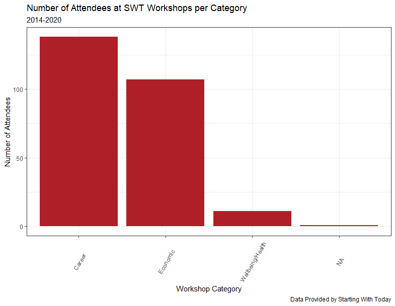
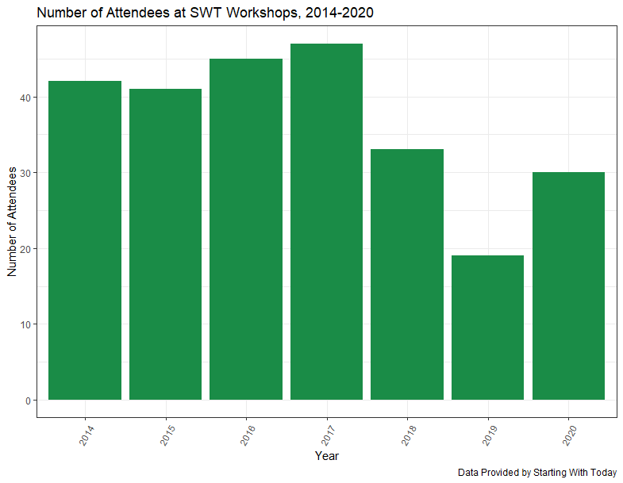
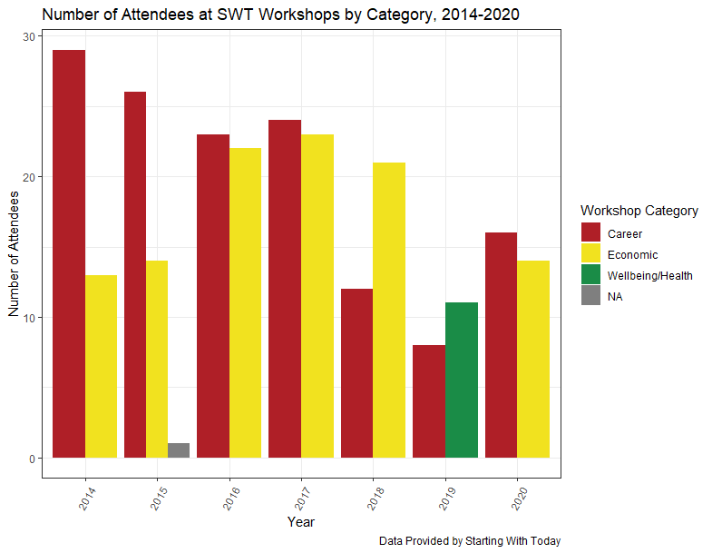
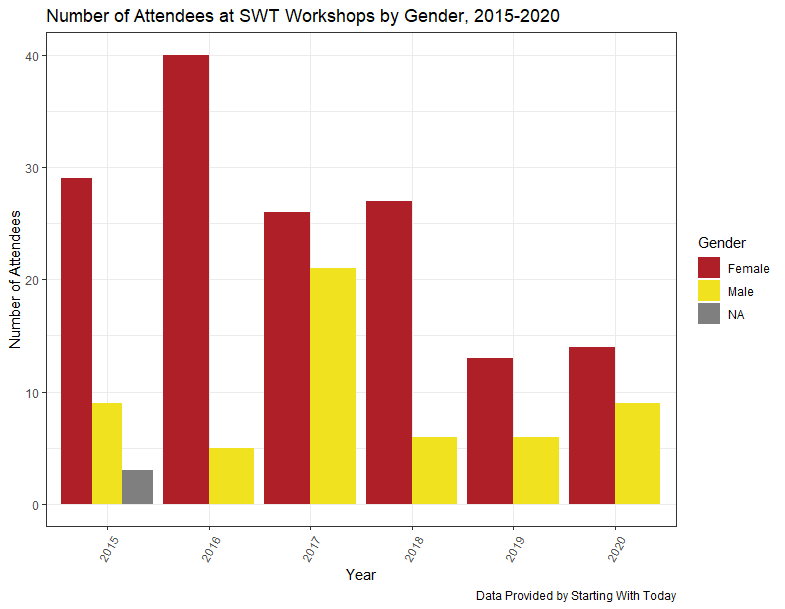
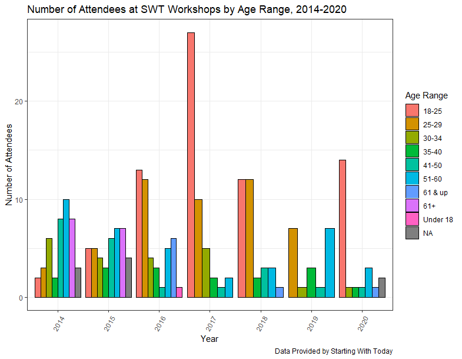

# StartingWithToday

`Starting With Today (SWT)` is a non-profit organization in Washington, DC, whose [mission](https://www.startingwithtoday.org/) is to: "To create, sustain, and enhance professional, mental, and financial wellness by providing customized training and resources to underserved adults."

SWT has collected data on participants' attendance to workshops in health and wellbeing, financial wellbeing, and career-related topics since 2014. The goals of this project are to:

* Conduct exploratory data analysis to evaluate year-over-year growth in the number of participants served and the characteristics of workshop participants
* Identify the geographical areas within Washington, DC, and the surrounding areas in Prince George's County, MD, where SWT could expand its services based on needs and assets of its target population

This project is organized in the following way:

1. To obtain the raw data, please copy the files in [this](https://drive.google.com/drive/u/0/folders/12p4VD-7L5YaSc3S5EtfVPix1LVyNr068) Google drive folder into the data folder in your local copy of this repository.
2. To execute this project, the R and Jupyter notebook files are meant to be executed in the following order:
* `1-preprocess_swt_data.qmd`: cleans the raw data and generates new files for use in the analysis
* `2.1-workshop_data_visualization.R`: produces counts of participants served by year, age group, and workshop type
* `2.2-feedback_analysis.ipynb`: produces the count of participants by gender and an average of workshop satisfaction ratings.
* `3.1-census_poverty_data.ipynb`: extracts data poverty rates by race from the 2020 Census by census tract.
* `3.2-unemployment-rate-data.ipynb`: extracts data of the unemployment rate from the 2020 Census by census block.
* `3.3-mental_health_data.ipynb`: extracts data of depression rates by census block from the Center for Disease Control.
* `4-web-scrapping-and-data-collection.ipynb`: extracts data of 1,000 non-profit organizations listed in [idealist.org](https://www.idealist.org/en/organizations?q=)

This project is expected to benefit SWT in mainly four ways:

* Computing counts of participants served to understand the characteristics of program participants
* Providing recommendations to continue strengthening data collection and identify outcome measures
* Creating a weighted measure to assess the needs of underserved communities in the Washington, DC, metropolitan area in terms of poverty, mental health, unemployment, wealth disparities and more. This measure will be created at the census block level and plotted on a map to visualize the areas of the region in need of SWT services and presence.
* Identifying the areas of the region with the most and least service providers for the types of services SWT provides.

This information will allow SWT to expand its services where they are needed most.

## Preliminary results:

Between 2014 and 2021, most workshops have been career-related, followed by economic-related topics. The least frequent topic type was health/wellness.

  </img>

The number of workshop participants ranged between over 40 in 2014 to slightly below 20 in 2019, although it increased again to 30 in 2020.

  </img>

On average, the number of career-related topics has decreased over time. Economic-related topics appeared to not have been offered in 2019 but had slightly more than 10 participants in 2020.

  </img>

Most participants across all years were female, but the number of male participants has increased slightly between 2019 and 2020.

  </img>

Several age ranges were represented in the data. Between 2016 and 2020, most participants were 29 or younger.

  </img>

Following are prelimanary versions of these plots for Community and Online Events. January 30, 2023

  </img>

  </img>

  </img>

  </img>

  </img>

  </img>

  </img>

