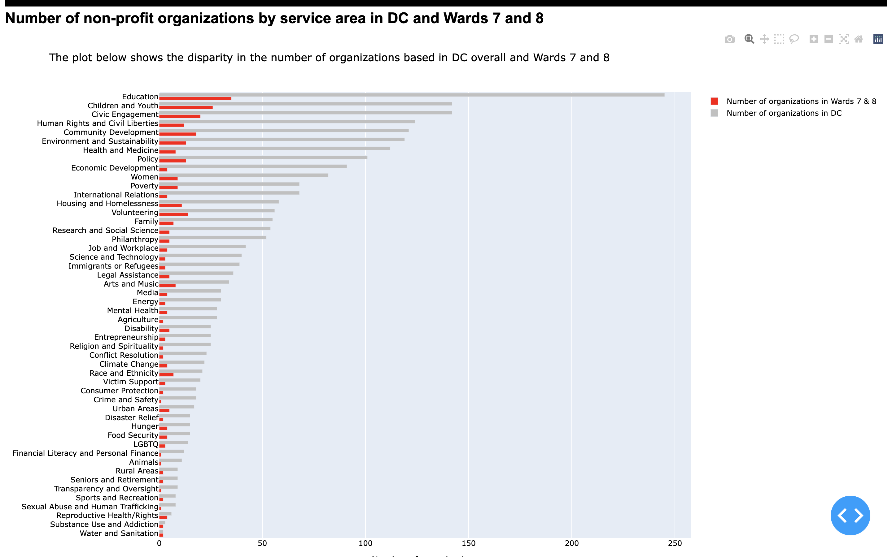
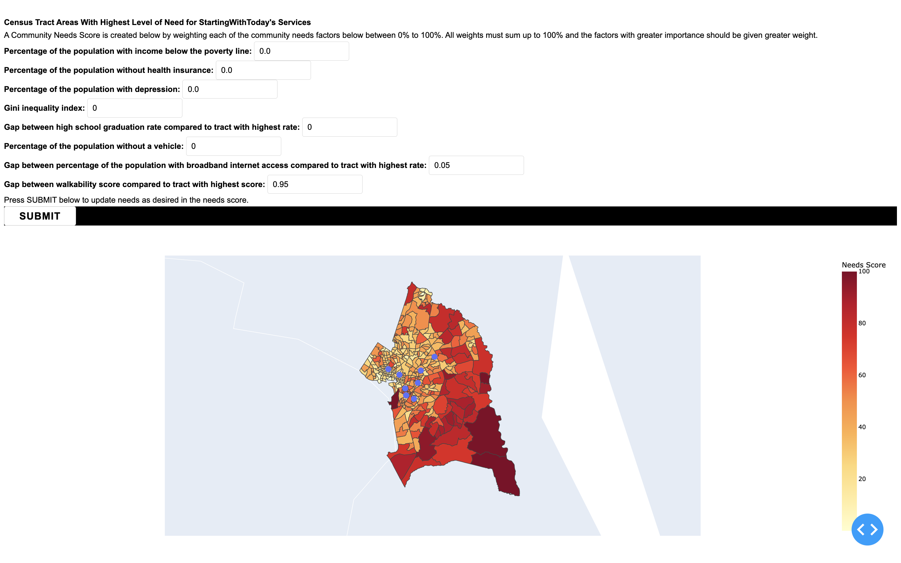
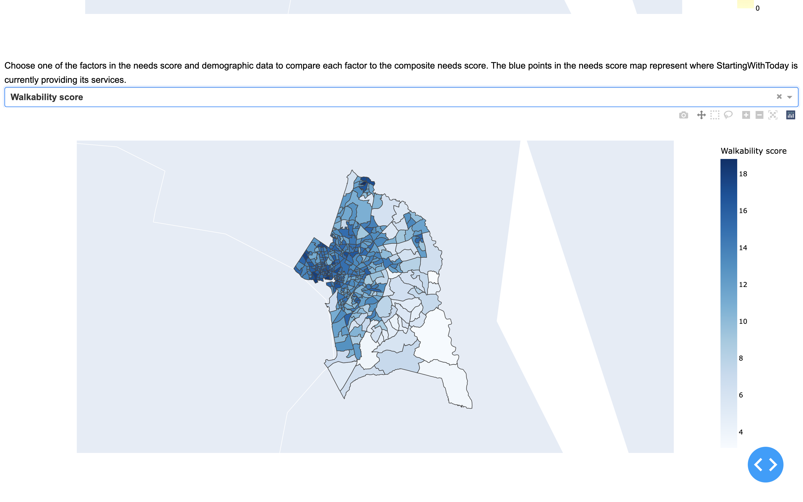
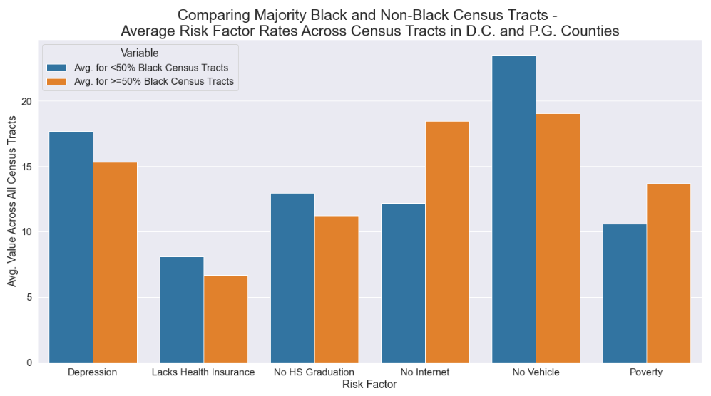
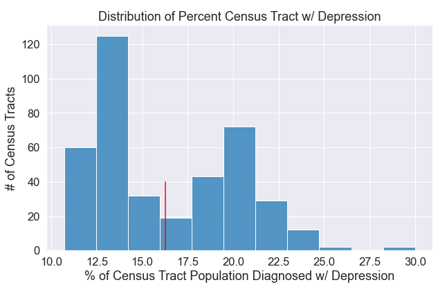
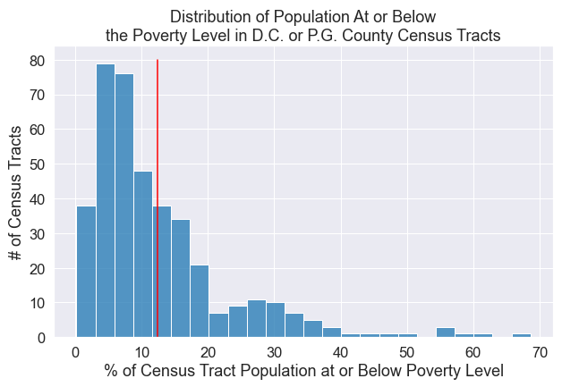
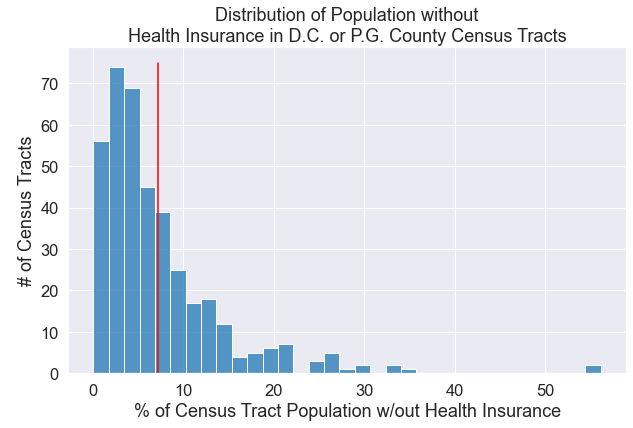
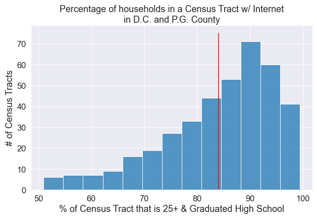

# StartingWithToday

`Starting With Today (SWT)` is a non-profit organization in Washington, DC, whose [mission](https://www.startingwithtoday.org/) is: "To create, sustain, and enhance professional, mental, and financial wellness by providing customized training and resources to underserved adults."

SWT partnered with DataKind to analyze data on program participation to its health and financial wellbeing workshops and create an online dashboard to identify census tracts in Washington, DC, region where SWT can expand its services.

**The goals of this project are to**:

* Analyze administrative data to determine the number of clients participating in SWT workshops
* Visualize the census tracts in Washington, DC, where there is a lack of services available around mental health and financial wellbeing and a high community need for these services based on factors such as poverty levels and depression rates

This project is organized in the following way:

1. To obtain the raw data, please copy the files in [this](https://drive.google.com/drive/u/0/folders/12p4VD-7L5YaSc3S5EtfVPix1LVyNr068) Google drive folder into the data folder in your local copy of this repository.
2. To execute this project, the R and Jupyter notebook files are meant to be executed in the following order:
* `1-preprocess_swt_data.qmd`: cleans the raw data and generates new files for use in the analysis
* `2.1-workshop_data_visualization.R`: produces counts of participants served by year, age group, and workshop type
* `2.2-feedback_analysis.ipynb`: produces the count of participants by gender and an average of workshop satisfaction ratings.
* `3.1-create_data_file.py`: generates a data set of community needs including poverty levels, depression rates, percent of the population that is uninsured and more by census tract in Washington, DC, and Prince George's County.
* `3.2-exploratory_data_analysis.ipynb`: produces EDA of Census CRE equity supplement and CDC data on depression rates
* `3.3-needs-score.ipynb:` ingests the data from notebook 3.4 and computes z-scores of all community needs attributes to create a composite `Needs Score`; exports the data used to visualize the needs score and other data.
* `4.1-web-scrapping-and-data-collection.ipynb`: extracts data of 1,000 non-profit organizations listed in [idealist.org](https://www.idealist.org/en/organizations?q=)
* `4.2-non_profit_orgs_data_cleaning_and_analysis.ipynb & 4.3-web-scrapped-data-plotting.ipynb`: clean the data extracted in script 4.1 for display in an online dashboard.
* `5-non-profit-orgs-map`: generates online dashboard using data generated from script 3.5.

## Data:

* Community Resilience Estimates Equity Supplement:
  * Source: [U.S. Census Bureau](https://www.census.gov/programs-surveys/community-resilience-estimates/data/supplement.html)
  * Description: This data set contains different columns indicating risk factors that might impact the community resilience of a certain area, including education rates, poverty rates, access to internet, etc.
  * How to download:
    1. Click the link above, scroll down to where you see “Tract”, and then click that link
    2. When prompted, name the file “cre_equity_census_tract_data.csv” and save in the “raw_data” folder
* CDC Depression rates:
  * Source: [Centers for Disease Control & Prevention - PLACES ](https://chronicdata.cdc.gov/500-Cities-Places/PLACES-Local-Data-for-Better-Health-Place-Data-202/eav7-hnsx)
  * Description: Reports on the percentage of adults living in within a census tract who have self-reported if they have ever been diagnosed with depression
  * How to download:
    1. Click the link above, and then click “Export”
    2. Click “CSV”
    3. When prompted, name the file “depression_census_tract_data.csv” and save in a folder named “raw_data”
* Walkability Index Score per Census Block
  * Source: U.S. Environmental Protection Agency
  * Description: The Walkability Index dataset characterizes every Census block group in the U.S. based on its relative walkability. Walkability depends upon characteristics of the built environment that influence the likelihood of walking being used as a mode of travel.
  * How to download:
    1. Click the link above, scroll down to where you see “Comma Separated Values File”, and click the “Download” button next to it
    2. When prompted, name the file “walkability_census_block_data.csv” and save in the “raw_data” folder

* idealist.org: contains information on non-profit organizations' profiles including characteristics such as name, address, and service areas

## Analysis of administrative data:

## StartingWithToday Community Needs and Resources Dashboard

The DataKind team developed a dashboard to identify service providers offering mental health and economic development services in the District of Columbia and nearby areas. Data from the U.S. [Census Community Resilience Estimates Equity Supplement](https://www.census.gov/programs-surveys/community-resilience-estimates/data/supplement.html) was used to create a composite needs score to identify census tracts in Washington, DC, and Prince George’s County with the greatest need for services offered by StartingWithToday.

### Community resources

Using data from [idealist.org](https://www.idealist.org/en/organizations?q=), BeautifulSoup and Selenium libraries were used non-profit organizations’ key information such as name, service or issue areas of work, address, etc. The [Google Maps API](https://developers.google.com/maps) was used to access the coordinates of each organization's address and produce the map in the left photo below. The user can select service areas and the map will locate organizations that provide services in that particular area. The horizontal bar chart on the left displays the number of non-profit organizations in the idealist.org directory by service type in Washington, DC, less organizations based in Wards 7 and 8, and the number of organizations in Wards 7 and 8, a geographical area of priority for StartingWithToday.

To update the map, run scripts 4.1 and 4.2 in the main branch of this project’s repo. To run it, please make sure there is an up to date chromedriver file in your machine and that you have an API key for the Google Maps API. The files generated through this script are currently saved in AWS S3 objects [here](https://docs.google.com/spreadsheets/d/1F0isvtoLjkbqA6tih8RMfcfXdOJ035EVWBRF65fhGaA/edit#gid=0).

### Community needs
This score is composed of the following features:
* Percent of the population with income below the poverty line
* Depression rate
* Percent of the population without health insurance
* Gini inequality index
* Percentage of households without vehicle access
* Percentage of the population without internet access
* Percentage of the population with a high school degree
* Walkability score

Each of these features is assigned a weight from 0% to 100% for a total composite weight of 100% among all factors. The data generated by script [create_data_file.py](https://github.com/DataKind-DC/StartingWithToday/blob/main/create_data_file.py) is ingested by script 3.5 to generate z-scores of each of these factors to standardize the data prior to creating the weighted composite score. In the dashboard, the user can modify the weights of each factor with the expectation that all weights should add up to 1. A choropleth map of the needs score is plotted next, highlighting in a darker color the census tracts with the greater need as defined by the weights assigned by the user. The map that follows provides the detail of each individual feature prior to data standardization for additional context.

This dashboard is generated through Python script 5-non-profit-orgs-map.py and is deployed to Heroku [here](https://starting-with-today-dashboard.herokuapp.com/). The code used to maintain the app is found in [this](https://git.heroku.com/starting-with-today-dashboard.git) separate Heroku GitHub repository.

## Data highlights from Census CRE Equity Supplement

### References:

* [Dash tutorial](https://dash.plotly.com/installation)
* [Deploying Dash apps](https://dash.plotly.com/deployment)
* [Community Resilience Equity Estimates Supplement](https://www.census.gov/programs-surveys/community-resilience-estimates/data/supplement.html)
* [GIS GEOJSON Census Tracts](https://github.com/arcee123/GIS_GEOJSON_CENSUS_TRACTS)
* [Adding local image to Dash app](https://community.plotly.com/t/adding-local-image/4896)
* [Combining choropleth map and scatter layer](https://community.plotly.com/t/how-can-i-combine-choropleth-and-scatter-layer-in-a-plotly-map/29842/6)
